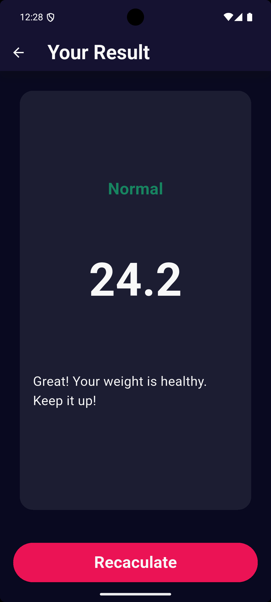
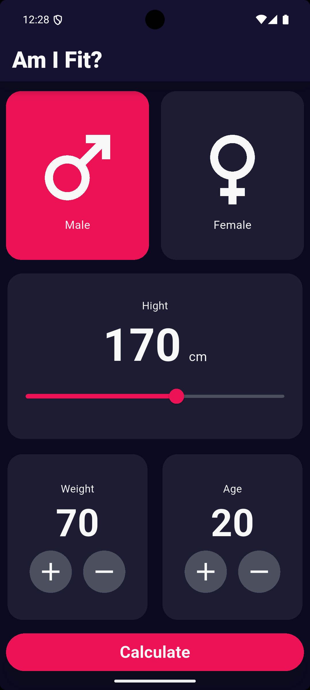

# 💪 BMI Calculator App

A simple yet functional BMI (Body Mass Index) calculator built using Flutter. The app allows users to input their height, weight, age, and gender to calculate and display their BMI score along with a health classification and motivational message.

---

## 🧠 What This App Does

- Allows the user to:
  - Select gender
  - Set height using a slider
  - Increment/decrement weight and age
  - Calculate BMI instantly
- Displays:
  - BMI result
  - Health category (e.g., Normal, Overweight, Obese)
  - A short motivational message with emoji 😊

---

## 🔧 Built With

- Flutter & Dart
- Custom widgets
- State management using `setState`
- Android Emulator / Physical device

---

## 📸 Screenshots

<div align="center">
  
  
  
</div>

> Make sure screenshots are in a folder called `screenshots` in the root of your project.

---

## 🏃 Getting Started

1. Clone the repository:
   ```bash
   git clone https://github.com/iMarinaAdel/My-BMI.git

